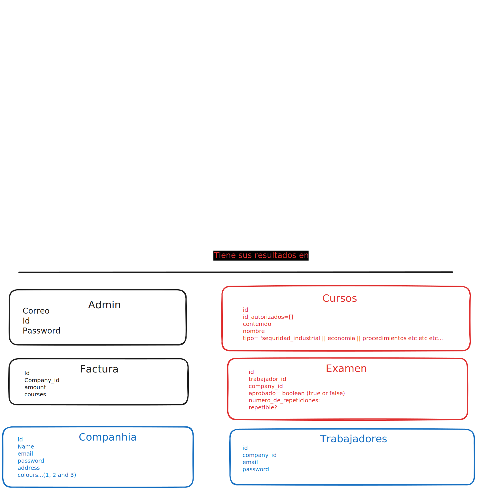

# Estructura tentativa de la base de datos

## Opciones hasta ahora:

1. Canvas LMS ---> Crear una plataforma propia.
2. Scorm cloud ---> Host para los scorms con API propia.
    https://rusticisoftware.com/thanks-contacting-us/
    https://rusticisoftware.com/products/scorm-cloud/api/

3. Usar la API de canvas LMS.
https://github.com/instructure/canvas-lms
